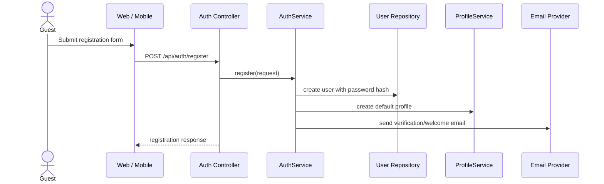
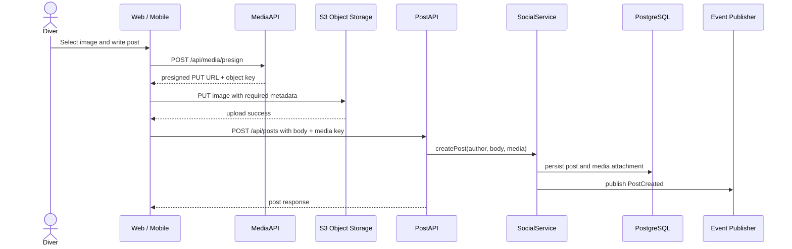
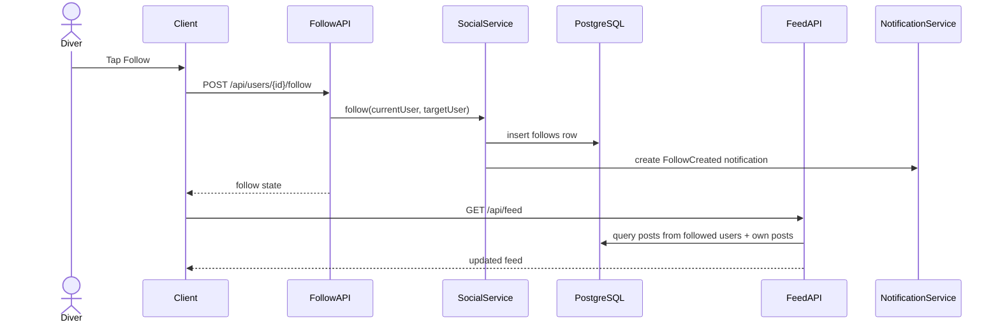
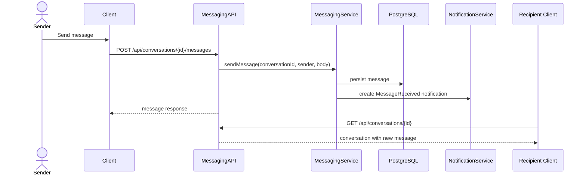

# Sequence diagrams

## Register and create profile

```mermaid
sequenceDiagram
    actor Guest
    participant Web as Web / Mobile
    participant AuthAPI as Auth Controller
    participant AuthService
    participant UserRepo as User Repository
    participant ProfileService
    participant Email as Email Provider

    Guest->>Web: Submit registration form
    Web->>AuthAPI: POST /api/auth/register
    AuthAPI->>AuthService: register(request)
    AuthService->>UserRepo: create user with password hash
    AuthService->>ProfileService: create default profile
    AuthService->>Email: send verification/welcome email
    AuthAPI-->>Web: registration response
```

## Create post with media

```mermaid
sequenceDiagram
    actor Diver
    participant Client as Web / Mobile
    participant MediaAPI
    participant Storage as S3 Object Storage
    participant PostAPI
    participant SocialService
    participant DB as PostgreSQL
    participant Events as Event Publisher

    Diver->>Client: Select image and write post
    Client->>MediaAPI: POST /api/media/presign
    MediaAPI-->>Client: presigned PUT URL + object key
    Client->>Storage: PUT image with required metadata
    Storage-->>Client: upload success
    Client->>PostAPI: POST /api/posts with body + media key
    PostAPI->>SocialService: createPost(author, body, media)
    SocialService->>DB: persist post and media attachment
    SocialService->>Events: publish PostCreated
    PostAPI-->>Client: post response
```

## Follow diver and refresh feed

```mermaid
sequenceDiagram
    actor Diver
    participant Client
    participant FollowAPI
    participant SocialService
    participant DB as PostgreSQL
    participant FeedAPI
    participant NotificationService

    Diver->>Client: Tap Follow
    Client->>FollowAPI: POST /api/users/{id}/follow
    FollowAPI->>SocialService: follow(currentUser, targetUser)
    SocialService->>DB: insert follows row
    SocialService->>NotificationService: create FollowCreated notification
    FollowAPI-->>Client: follow state
    Client->>FeedAPI: GET /api/feed
    FeedAPI->>DB: query posts from followed users + own posts
    FeedAPI-->>Client: updated feed
```

## Send message

```mermaid
sequenceDiagram
    actor Sender
    participant Client
    participant MessagingAPI
    participant MessagingService
    participant DB as PostgreSQL
    participant NotificationService
    participant Recipient as Recipient Client

    Sender->>Client: Send message
    Client->>MessagingAPI: POST /api/conversations/{id}/messages
    MessagingAPI->>MessagingService: sendMessage(conversationId, sender, body)
    MessagingService->>DB: persist message
    MessagingService->>NotificationService: create MessageReceived notification
    MessagingAPI-->>Client: message response
    Recipient->>MessagingAPI: GET /api/conversations/{id}
    MessagingAPI-->>Recipient: conversation with new message
```
