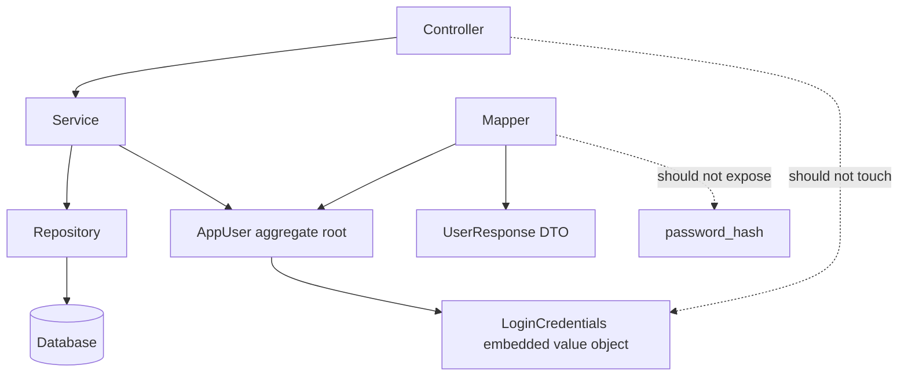

```mermaid
flowchart TD
    Controller[Controller] --> Service[Service]
    Service --> User[AppUser aggregate root]
    User --> Credentials[LoginCredentials embedded value object]
    Service --> Repository[Repository]
    Repository --> DB[(Database)]

    Mapper[Mapper] --> User
    Mapper --> DTO[UserResponse DTO]

    Controller -. should not touch .-> Credentials
    Mapper -. should not expose .-> PasswordHash[password_hash]
```
